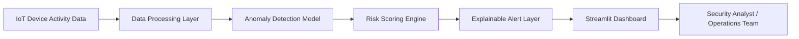

# 🛡️ SentinelAI

**SentinelAI** is an AI-powered cybersecurity intelligence dashboard for IoT systems. It detects anomalous device behavior, classifies security risk, and explains suspicious activity in plain English so security and operations teams can respond faster.

🔗 **Live Demo:** https://sentinelai-m9pwo2vhjw4oc3dk6f5ry9.streamlit.app/

---

## 🚀 Project Overview

IoT environments generate large volumes of device activity, network behavior, and operational data. Security teams often struggle to quickly identify which signals represent real risk and which alerts are noise.

SentinelAI solves this by combining anomaly detection, risk scoring, interactive dashboards, and explainable security insights into one decision-support product.

---

## 🎯 Target Users

- Security operations analysts
- IT support teams
- IoT operations managers
- Product managers working on connected systems
- Executives who need visibility into operational risk

---

## ✨ Key Features

- Detects anomalous IoT device behavior using machine learning
- Classifies suspicious activity into Low, Medium, and High risk
- Explains why a device was flagged using plain-English insights
- Provides executive-level security metrics
- Visualizes device risk by time, location, and device behavior
- Includes a security investigation panel for incident review

---

## 🧠 Product Thinking

SentinelAI is designed as more than a dashboard. It is a product experience focused on helping users move from raw technical alerts to faster decision-making.

### User Problem
Security teams receive too many alerts without enough context to prioritize what matters.

### Product Solution
SentinelAI translates device behavior into risk levels, explanations, and investigation workflows.

### Success Metrics
- Time to detect high-risk activity
- Reduction in alert review time
- Percentage of high-risk events investigated
- User satisfaction with alert explanations
- Incident response efficiency

---

## 🛠️ Tech Stack

- Python
- Streamlit
- Pandas
- Scikit-learn
- Plotly

---

## 🏗️ Architecture



---

## 📸 Screenshots

Add screenshots here:

```md


```

---

## 💼 Resume Bullet

Built and deployed SentinelAI, an AI-powered IoT cybersecurity dashboard using Python, Streamlit, Scikit-learn, and Plotly to detect anomalous device behavior, classify security risk, and explain suspicious activity for security and operations teams.

---

## 🔮 Future Roadmap

- Add real-time IoT data ingestion
- Add user authentication and role-based access
- Add alert investigation notes
- Integrate with Jira or ServiceNow incident workflows
- Add natural-language incident summaries